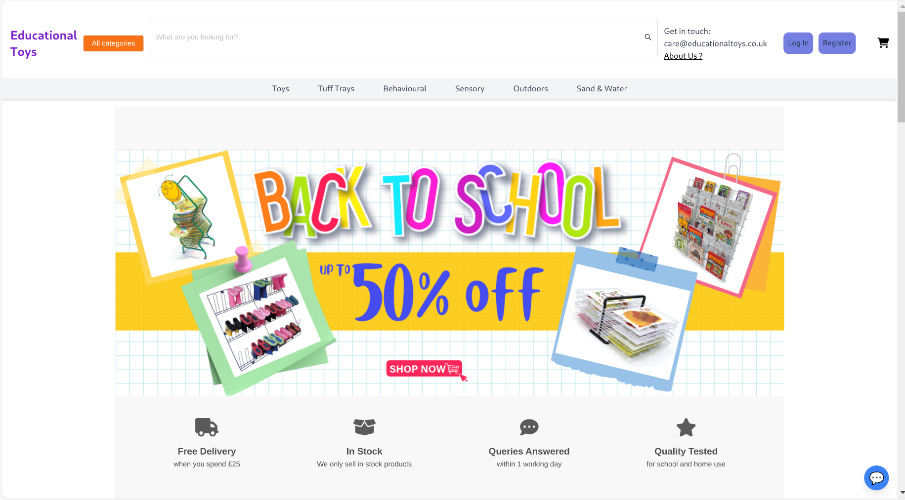

# Educational Toys Application

This project is a full-stack application for managing educational toys. It consists of a backend built with Spring Boot and a frontend built with React and Vite.

## Backend

The backend is a Spring Boot application that provides RESTful APIs for managing users, authentication, categories, and toys. It also integrates with Stripe for payment processing and Cloudinary for image storage.

### Key Features

- User authentication and authorization with JWT
- WebSocket support for real-time communication
- Integration with Stripe for payment processing
- Integration with Cloudinary for image storage
- Redis for caching
- Swagger for API documentation

### Running the Backend

1. Navigate to the `backend` directory.
2. Run `./mvnw spring-boot:run` to start the backend server.

## Frontend

The frontend is a React application built with Vite. It provides a user interface for managing toys, categories, and user authentication.

### Key Features

- User authentication with JWT
- Integration with the backend APIs
- Role-based access control

### Running the Frontend

1. Navigate to the `frontend-reactjs` directory.
2. Run `npm install` to install dependencies.
3. Run `npm run dev` to start the frontend server.

## Environment Variables

Both the backend and frontend require environment variables. Refer to the `.env` files in their respective directories for the required variables.
